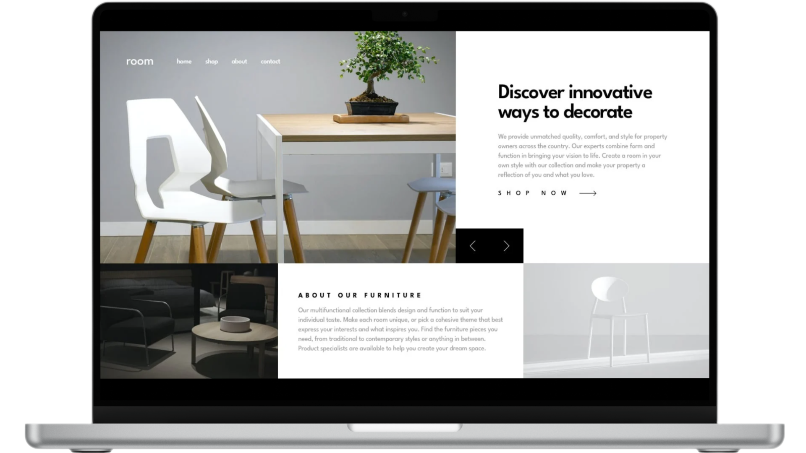

# Room

<figure>
    
</figure>

## 📝 **Sobre o Projeto**

    Room é uma homepage moderna, criada com o conceito mobile-first. O conteúdo é alternado de forma dinâmica por meio de botões interativos de avanço e retorno. Seu design fluido e responsivo garante uma experiência impecável em qualquer dispositivo.

[Demo do Projeto](https://room-walacedev.netlify.app/) 

## 🛠️ **Tecnologias Utilizadas**

- **HTML5** para a estrutura do conteúdo.
- **CSS3** para estilização e design responsivo.
- **JavaScript** para funcionalidades dinâmicas.
- **Sass** (Syntactically Awesome Stylesheets) para pré-processamento de CSS.

## 🚀 **Recursos Principais**
- **Design moderno e intuitivo:** estética atraente e fácil de navegar
- **Navegação dinâmica com botões interativos:** alternância de conteúdo de forma simples e eficiente
- **Layout totalmente responsivo:** adaptação perfeita a diferentes tamanhos de tela
- **Conteúdo alternável sem recarregar a página:** experiência interativa contínua
- **Mobile-first:** projetado para oferecer uma experiência otimizada em dispositivos móveis, garantindo fluidez em qualquer tela

## 📂 **Estrutura do Projeto**

├── src 
│   ├── assets          # Imagens 
│   ├── css             # Arquivo de estilização 
│   ├── js              # Arquivo de JavaScript 
│   └── sass            # Arquivos de pré-processador Sass 
├── .gitattributes      # Configurações de atributos do Git 
├── LICENSE             # Licença MIT 
├── README.md           # Documentação do projeto 
└── index.html          # Arquivo principal HTML do projeto

